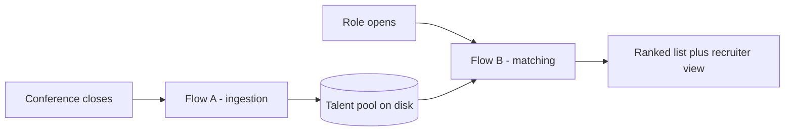
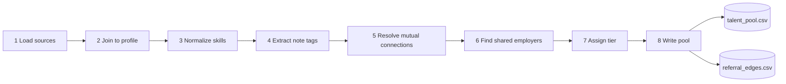
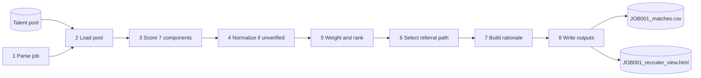
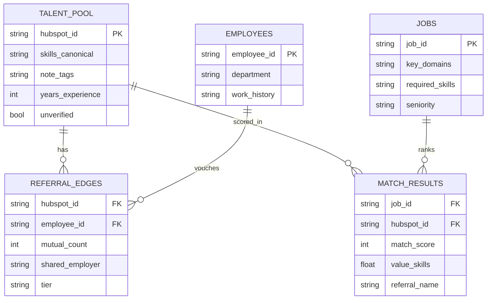
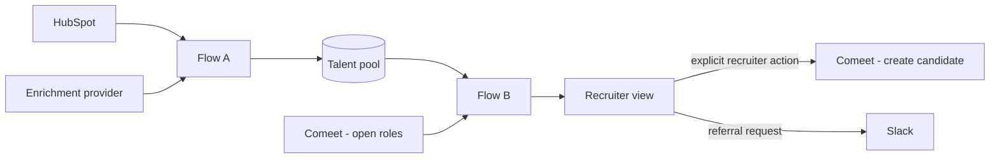

# ARCHITECTURE.md

Technical architecture of the conference-attendee talent pool pipeline: flows, triggers, modules,
stores, data model, and the integration surface that replaces the CSV mocks in production.

Rationale is not repeated here. `DECISIONS.md` holds it. `SPEC.md` holds the implementation contract
— function signatures, scoring rules, column names.

---

## 1. System shape

Two flows, two triggers, no shared process state. The pool on disk is the only interface between
them.

**Partition rule.** Job-independent work is Flow A; job-dependent work is Flow B.

| Concern | Flow A | Flow B |
| :---- | :---- | :---- |
| Skills | normalization to canonical names | overlap against the requirement set |
| Field notes | tag extraction | tag comparison to key domains |
| Referrals | edge construction and grading | edge selection |

**Invariants.**

- Flow A never reads a job record. Flow B never reads `conference_attendees.csv` or
  `linkedin_profiles.csv`.
- Flow A is idempotent on `hubspot_id`; re-running against the same event does not duplicate rows.
- Flow B is a pure function of the pool, the job row and the config files. No network, no clock, no
  randomness.
- Two consecutive runs of either flow produce byte-identical output.

## 2. Triggers and entry points

| Flow | Command | Production trigger | Frequency |
| :---- | :---- | :---- | :---- |
| A | `python pipeline/main.py ingest` | badge-scan export or event-close webhook | 2–3 / month |
| B | `python pipeline/main.py match --job JOB001` | recruiter action on role open | on demand |
| both | `python pipeline/main.py run --job JOB001` | — | — |

`match` against an empty pool exits non-zero with a message naming the `ingest` command.

## 3. Stores

| Path | Kind | Written by | Read by |
| :---- | :---- | :---- | :---- |
| `data/conference_attendees.csv` | source | — | A1 |
| `data/linkedin_profiles.csv` | source | — | A1 |
| `data/wsc_employees.csv` | source | — | A1 |
| `data/job_openings.csv` | source | — | B1 |
| `data/skill_aliases.json` | config | — | A3, B1 |
| `data/title_families.json` | config | — | B3 |
| `data/company_domains.json` | config | — | B3 |
| `pool/talent_pool.csv` | state | A8 | B2 |
| `pool/referral_edges.csv` | state | A8 | B2 |
| `output/JOB001_matches.csv` | artifact | B8 | — |
| `output/JOB001_recruiter_view.html` | artifact | B8 | — |

Config is data, not code: extending the alias table requires no release.

---

## 4. Flow A — ingestion

| Step | Input | Transformation | Output |
| :---- | :---- | :---- | :---- |
| 1 | four CSVs, three JSON | parse | dataframes and config dicts |
| 2 | attendee rows, profile rows | left join on normalized `linkedin_url` | merged rows, `unverified` boolean |
| 3 | `top_skills` | canonical-set match, then alias table, then passthrough | `skills_canonical`, `skills_alias_hits` |
| 4 | `notes` | lowercase, strip punctuation and stopwords, alias-expand | `note_tags`, `flagged_on_site` |
| 5 | `wsc_mutual_connections` | split on `;`, resolve each id against the roster | one edge per employee, `mutual_count` |
| 6 | `past_companies`, `work_history` | token-bounded set intersection | `shared_employer` on new or existing edges |
| 7 | edge attributes | classify | `tier` in `{A, B, C}` |
| 8 | merged rows, edges | serialize | two CSVs |

**Step 2.** Join key is `linkedin_url` after stripping whitespace, scheme and `www.`. No name-based
fallback. Unmatched rows are retained with profile-derived fields empty.

**Step 5.** `mutual_count` is a per-candidate scalar, written identically onto every edge of that
candidate.

**Step 6.** Tokenize both sides, drop the generic token list, require a shared token of length ≥ 4.
Substring matching is prohibited — it pairs `Intel` with `IDF Intelligence Unit`. This step may
create edges for candidates whose `mutual_count` is 0.

**Step 7.** `A` = `shared_employer` present. `B` = `mutual_count >= 3`. `C` = `mutual_count` in
`{1, 2}`. Tier `D` denotes the absence of an edge and is never persisted.

**Step 4 computes tags only.** The note's scoring value depends on the job and is computed in B3.

---

## 5. Flow B — matching

| Step | Input | Transformation | Output |
| :---- | :---- | :---- | :---- |
| 1 | job row, alias table | split, normalize, tokenize, map seniority to a years threshold | requirement set, domain vocabulary |
| 2 | two pool CSVs | parse, deserialize list columns | pool rows, edge rows |
| 3 | pool row, requirement set | seven component functions | seven floats in `[0, 1]`, three skill lists |
| 4 | component values, `unverified` | divide by the sum of available weights instead of 100 | comparable score, `score_basis` |
| 5 | component values, weight dict | multiply, sum, sort | `match_score`, `points_*`, rank order |
| 6 | edges for the candidate, job department | filter, order by tier then department distance then count | one edge or none |
| 7 | component values, skill lists | template | `rationale`, `interview_probes` |
| 8 | scored rows | serialize twice | matches CSV, recruiter view HTML |

**Component contract.** Each of the seven functions takes `(pool_row, requirements)` and returns a
float in `[0, 1]`. Weights are applied once, in step 5, from a single dictionary in `score.py`. No
component returns points. Rules are in `SPEC.md` §3.

**Step 4.** Computable components without a profile: title, notes, conference. Denominator is the sum
of those weights.

**Step 5.** `match_score = round(Σ(value × weight) / Σ(weight) × 100)`. Ties break on
`years_experience`, then `hubspot_id`.

**Step 6.** Edges with `referral_feedback == "insufficient"` are excluded before ordering. Department
distance is an explicit map: same department 0, named adjacent pair 1, otherwise 2.

**Step 8.** Both artifacts are serialized from the same in-memory rows in one call. The HTML embeds
the data as a JSON literal and requires no server. Its weight sliders mutate browser state only; the
CSV always carries default weights.

---

## 6. Data model

Eight tables: the five above, the two raw source tables consumed once at A2, and the alias
dictionary.

`REFERRAL_EDGES` is a separate relation because the cardinality is many-to-many and because
`mutual_count`, `shared_employer`, `tier` and `referral_feedback` are attributes of the pair.
`referral_feedback` is stored on the edge, not on the candidate, so feedback adjusts a score without
mutating it — `match_score` and `match_score_after_feedback` are separate columns.

`ats_status` and `referral_feedback` are emitted and unpopulated in this submission.

List-valued columns are `;`-delimited on write and split on read. Full column lists are in
`SPEC.md` §2 and §3.

---

## 7. Modules

| Module | Flow | Steps | Owns |
| :---- | :---- | :---- | :---- |
| `ingest.py` | A | 1 | file reads only |
| `enrich.py` | A | 2–8 | join, normalization, tags, edges, pool write |
| `score.py` | B | 1–5 | requirement parsing, components, normalization, ranking |
| `output.py` | B | 6–8 | referral selection, rationale, CSV writer, HTML writer |
| `main.py` | both | — | argument parsing and sequencing, no logic |

Dependency direction is one-way: `main` → `{ingest, enrich, score, output}`. No module imports
another peer. No module imports a network library.

The recruiter view is generated by `output.py`, not maintained by hand.

---

## 8. Model boundary

Four inputs in the system are free text. Everything else is a structured-field comparison and is
implemented as arithmetic.

| Touchpoint | Step | Submitted implementation | Seam |
| :---- | :---- | :---- | :---- |
| Unknown skill alias | A3 | dictionary lookup, passthrough on miss | `resolve_unknown_alias` |
| Field note | A4 | token extraction against a vocabulary | note tag extractor |
| Job description | B1 | parsed from CSV columns | `parse_job` |
| Rationale sentence | B7 | template over component values | rationale builder |

No model is called at runtime. Each seam function is deterministic and carries a docstring naming
the production implementation. Reason and trade-off: `DECISIONS.md` §3.3.

Scoring is never a model call.

---

## 9. Production topology

### 9.1 Capture layer

The source CSVs represent the output of a capture pipeline that runs before A1.

| Stage | Mechanism | Output |
| :---- | :---- | :---- |
| Registration | event form writes a lead object to HubSpot | contact with self-reported name, company, title, profile URL |
| Attendance | badge scan reconciled against registrations | confirmed attendance, event id |
| Annotation | structured on-site input from staff | judgment tag |
| Enrichment | licensed provider keyed on profile URL | skills, experience, industry, past employers, connections |
| Normalization | canonical skill resolution | comparable skill list |
| Persistence | contact property write | queryable pool record |

Enrichment constraints the design must absorb: rate limited, so batched and queued rather than
synchronous; partial coverage, so unmatched contacts are flagged rather than dropped; per-lookup
cost, so enrichment runs once per person in Flow A and never per query in Flow B.

### 9.2 Per-step integration surface

| Step | Submitted | Production |
| :---- | :---- | :---- |
| A1 | read four CSVs | HubSpot contacts API filtered by event list; enrichment provider batch job |
| A2 | exact join on `linkedin_url` | provider records keyed on the same URL; unmatched go to a review queue, still `unverified` |
| A3 | dictionary lookup | dictionary plus model resolution for misses, cached back to the dictionary |
| A4 | token extraction | model returning structured tags, or structured capture upstream removing the need |
| A5 | parse delimited id list | connection data from the provider; roster from the HR system |
| A6 | roster comparison | unchanged |
| A7 | classify | unchanged |
| A8 | write two CSVs | write HubSpot contact properties; HubSpot is the system of record |
| B1 | read three CSV columns | Comeet role by id, parsed from prose by model |
| B2 | read two CSVs | query contact properties for the pool segment |
| B3–B7 | arithmetic | unchanged |
| B8 | write CSV and HTML | same artifacts, plus in-app view, Comeet candidate creation on explicit action, Slack referral request |

### 9.3 Boundaries

B3 through B7 are byte-for-byte identical between the submission and production. The scoring path has
no integration dependency and is testable without one.

Two external writes exist. The pool write is idempotent on `hubspot_id`. The ATS write is gated on an
explicit recruiter action. Nothing advances a person into a hiring process automatically.

### 9.4 Scale envelope

~30 events per year × 30–100 attendees = 900–3,000 records per year; 5,000–9,000 rows at three years;
five recruiters, tens of concurrent roles.

Flow A decomposes into one scheduled worker per step with retries and queues without restructuring.
Flow B remains a single-pass scan over the pool. Model call volume after exact and dictionary
matching is on the order of tens per event, decaying as the dictionary saturates.

---

## 10. Failure modes

| Condition | Behaviour | Step |
| :---- | :---- | :---- |
| no profile match | row retained, `unverified` set, score normalized over available weights | A2, B4 |
| `wsc_mutual_connections` empty | no edges from A5; A6 may still produce one | A5, A6 |
| no edges at all | referral fields empty, row retained and ranked | B6 |
| skill absent from the alias table | passthrough, counted as missing | A3 |
| note absent | notes component returns 0 | B3 |
| edge marked `insufficient` | excluded from selection, score unchanged | B6 |
| pool directory empty or missing | non-zero exit naming the `ingest` command | B2 |
| unknown `job_id` | non-zero exit listing valid ids | B1 |

In the supplied data all 75 attendees match a profile, so the `unverified` path is implemented and
unit-testable but not exercised by the provided files.
