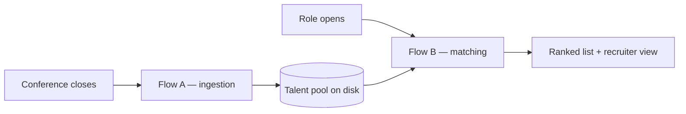
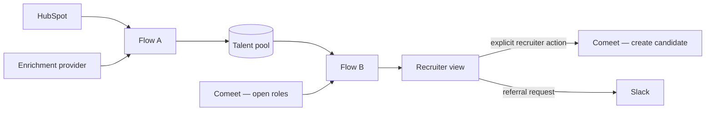

# Design document

Conference-attendee talent pool: capture attendees as leads, enrich them once, and rank the pool
against an open role on demand.

Deeper material — full architecture, exact scoring rules, column contracts, failure modes — is in
[`docs/reference/`](docs/reference/).

---

## 1. Why this approach

### Two flows on two triggers, not one pipeline

> **Partition rule.** Anything true about a person *regardless of any job* → **Flow A**, run once
> after each conference. Anything measured *against a specific job* → **Flow B**, run on demand.

So skill *normalization* is Flow A and skill *overlap* is Flow B; referral *edge construction* is
Flow A and referral *selection* is Flow B.

Three consequences make it work:

- **Expensive work runs once per person, not once per person per job.** Profile enrichment is rate
  limited and costs per lookup; running it per query would not survive a real provider.
- **Flow B makes no external call.** It is arithmetic over pre-processed data, so it stays fast as
  the pool grows.
- **The flows share no process state.** The pool on disk is the only interface, so ingestion can run
  today and matching next month — which is the actual usage pattern.

### Transparent scoring, not a black box

Seven components, each returning a value in `[0,1]`, each multiplied by a weight. Nothing is filtered
out before being scored.

| Component | Weight | Value |
| :---- | ----: | :---- |
| Skill overlap | 30 | matched required skills ÷ total required |
| Title match | 25 | discipline head-noun of the role, plus a seniority bonus |
| Years of experience | 15 | 1.0 at or above the seniority threshold; scaled below |
| Industry | 13 | 1.0 sports; 0.5 adjacent video/broadcast/streaming; 0 otherwise |
| Field notes | 10 | 1.0 if the note references a key domain; 0.5 generic; 0 absent |
| Past companies | 5 | 1.0 sports; 0.5 media or video; 0 otherwise |
| Conference domain | 2 | 1.0 if the event domain overlaps the role's domains; 0 otherwise |

**Separating the value from the weight is the whole design.** The component states a fact — four of
five required skills is `0.80`. The weight states a judgment — what that fact is worth for this role.
Keeping them apart is what lets the recruiter view expose the weights as **live sliders**, makes each
score readable as `value × weight = points`, and makes normalization for missing data possible.

The weights are a reasoned starting point, not a derivation — deriving them needs hiring-outcome
history. They encode a stated ordering: skills and title dominate because they describe what a person
*does*; the conference barely matters. Once outcomes accumulate they can be calibrated from results.

**Why nothing is filtered.** A sports-tech conference draws practitioners *and* an IT manager from a
hospital. The tempting fix is to filter on title, and it is wrong: filtering on title would have
removed Priya Anand — whose title contains no "ML" — before her skills were read, and she is one of
the strongest candidates for JOB001. Signal-to-noise is solved by *ranking*: the hospital IT manager
scores 0 on skills, title, industry and notes, and lands 55th of 75.

### Where a model earns its cost

> **A model reads free text. Rules compare structured fields.**

The supplied data is overwhelmingly structured — skills are delimited lists, experience is an
integer. Comparing structured fields is arithmetic: exact, free, instant, explainable. Wrapping it in
a model adds latency, cost and non-determinism while producing a similarity number a recruiter cannot
defend to a hiring manager. That rules out RAG and vector search too: there is no unstructured corpus
here, and approximate retrieval would replace an exact comparison with a score that has no reason
attached.

Free text exists in exactly four places, and each is a documented seam:

| Touchpoint | This submission | In production |
| :---- | :---- | :---- |
| Non-standard skill names | dictionary lookup | model resolves misses, caches back to the dictionary |
| On-site field notes | token extraction against a vocabulary | model returns structured signal tags |
| Job descriptions | parsed from three CSV columns | model parses a prose role description |
| Rationale and probes | template over component values | model infers what to ask on the call |

**No model runs on the default path**, so this repo needs no API key and the same candidate scores
the same number on every run. A shortlist that shifts between executions cannot be defended.

**One measured effect, verifiable without a key.** The alias dictionary was generated by a model
(`pipeline/build_aliases.py`, run once, result committed). Before it resolved "Sports CV" and "Event
Detection" against Marcus Reid's skills he ranked 5th at 75, missing 3 of 5 required skills. After,
he ranks 2nd at 87, missing only AWS. **No scoring code changed** — the swing is entirely the
generated dictionary.

### Referrals are context, not points

Mutual connections carry **zero scoring weight**. They say nothing about professional fit; a strong
candidate is strong with zero connections. What the team needs is *who to ask*, so the output names
the person. Both sides of the data carry dates — the roster's `work_history` and the candidate's
`past_titles` — so a shared employer becomes checkable: two people who **actually overlapped**, not
merely both drew a paycheck there.

| Tier | Condition | Pairs |
| :--- | :---- | ---: |
| **A** | shared employer + confirmed overlap + a mutual connection | 12 |
| **B** | no shared employer, 3+ mutual connections | 11 |
| **C** | 1–2 mutual connections, or a shared employer backed by only one of {overlap, mutual} | 60 |
| **D** | shared employer, no overlap, no mutual connection | 2 |

The recruiter-facing string never overstates: `worked together at Opta Sports, 2019-2021` when the
dates confirm it, `both worked at IDF Intelligence Unit, no overlapping years` when they don't.

---

## 2. Assumptions

| # | Question | Answer |
| :--- | :---- | :---- |
| 1 | **Defining domain relevance** | A weighted, transparent score — never a filter. Nobody is excluded before being scored; noise sinks in the ranking. |
| 2 | **No LinkedIn profile match** | **Kept and flagged**, never dropped. Only three of seven components are computable (title, notes, conference), so the score is normalized over those weights — `25+10+2 = 37` — and the record carries `unverified`. Missing data must not read as poor fit. |
| 3 | **1 mutual connection vs. 3** | Neither scores points. Both become *who to ask*, graded A–D by combining connections with confirmed tenure overlap. |
| 4 | **Candidates already in the ATS** | Flagged via `ats_status`, populated in production by a **read-only** lookup returning whether a process exists, its outcome and date. Here the column exists and is empty. |
| 5 | **Refresh cadence** | Ingest after each conference (2–3×/month); match on demand; re-enrich profiles every 6–12 months; archive after 36 months without interaction. |
| 6 | **Who triggers it** | Ingestion automatic on event close. Matching recruiter-initiated. **ATS handoff manual by design** — consent is the trigger and is not machine-detectable. |
| 7 | **Privacy / GDPR** | A registrant consented to attend an event, not to join a candidate database. The pool therefore **lives outside the ATS**; the registration form carries a **soft opt-in**; every record stores its source event and capture date and honours deletion. LinkedIn's terms prohibit scraping, so production enrichment goes through a licensed provider. |

**On data quality.** All 75 supplied attendees match a LinkedIn profile, so the `unverified` branch
is implemented but not exercised by the provided files — `data/edge_cases/` is a synthetic fixture
built to exercise it and nine other branches the supplied data never reaches. Company matching is
token-bounded rather than substring-based, because naive matching pairs a candidate from `Intel` with
an employee from an `IDF Intelligence Unit`. A malformed tenure date is treated as "no overlap"
rather than guessed at.

**On scope.** `ats_status` and `referral_feedback` are emitted and unpopulated — the fields are
defined, the data is not available here.

---

## 3. Production integrations

| Direction | System | Requirement |
| :---- | :---- | :---- |
| Read | **HubSpot** | event registrants as contact records, with custom properties for talent-pool fields |
| Read | **Comeet** | open roles by id; candidate history by identifier |
| Write | **Comeet** | create a candidate **on explicit recruiter action**, with source attribution |
| Read | **Enrichment provider** | profile data keyed on profile URL, batched and queued |
| Write | **Slack** | referral request to the connected employee, with structured reply options |

**The supplied CSVs represent a capture layer that runs before ingestion:** registration writes a
lead to HubSpot → badge scan reconciles attendance → staff add a structured annotation → a licensed
provider enriches on profile URL → canonical skill resolution → contact-property write.

**On the LinkedIn API.** There is no public LinkedIn API for this, and their terms prohibit scraping.
Production enrichment goes through a **licensed data provider** keyed on the profile URL. Three
constraints the design already absorbs: it is rate limited, so enrichment is batched and queued
rather than synchronous; coverage is partial, so unmatched contacts are flagged `unverified` rather
than dropped; and it costs per lookup, so enrichment runs **once per person in Flow A** and never per
query in Flow B.

**On HubSpot.** Talent-pool fields map onto contact properties, so the pool *extends* contact records
rather than creating a parallel database. HubSpot stays the system of record for the contact;
scoring lives in the pipeline.

**On Comeet.** The stated constraint is that leads may not be held in the ATS. The distinction that
resolves it: *storing a pool* is not *entering a person*. The pool lives outside; an individual
enters only when a real process begins, and only on a recruiter's explicit click. A Comeet webhook on
role-open can pre-warm a shortlist, but nothing advances a person automatically.

**What does not change.** The entire scoring path is byte-for-byte identical between this submission
and production. It has no integration dependency, which is what makes the ranking defensible.

---

## 4. At scale

Hundreds of conferences and thousands of contacts is the stated target. Concretely: ~30 events per
year at 30–100 attendees is 900–3,000 new records annually — **5,000–9,000 rows after three years**,
against five recruiters and tens of concurrent roles. Well past where spreadsheets collapse; far
short of anything needing distributed infrastructure.

| Concern | At this scale |
| :---- | :---- |
| **Flow A** | Decomposes into one scheduled worker per stage with retries and queues — no restructuring needed, because the stages already share no state. |
| **Flow B** | Stays a single-pass scan over a table. Sub-second at 10k rows. |
| **Storage** | HubSpot contact properties, not a new database. The pool is a segment, not a system. |
| **Model cost** | Negligible. After exact and dictionary matching, a 100-person event generates on the order of tens of alias-resolution calls, twice a month, **decaying as the dictionary saturates**. |
| **Enrichment cost** | The dominant real cost, and the reason it is once-per-person. Bounded by new attendees, not by queries. |
| **Referral load** | One employee already connects to 14 of the 75 attendees. A per-employee request cap becomes necessary well before the data does. |

The architecture that makes this hold is the two-flow split. Because matching never enriches, adding
roles costs nothing; because ingestion never scores, adding conferences costs nothing beyond the
enrichment itself.

---

## 5. What I would add with more time

| | Why |
| :---- | :---- |
| **Conference-domain relevance stored at ingestion** | A `conference_relevance` score, classification and reason per attendee, so the pool can answer "who from this event is genuinely in-domain" without first picking a role. |
| **One-click referral request with structured replies** | Closes the loop that `referral_feedback` already models but nothing yet writes. |
| **Structured on-site annotation** | Replacing free-text notes would raise the ceiling on that signal from 10 points to something much higher. |
| **Pipeline status tracking** | First contact through process, so the pool shows state rather than a snapshot. |
| **Conference ROI analysis** | The measurement that source tagging makes possible — which events actually produce placements. |
| **Outcome-driven weight calibration** | Replace the reasoned starting point with weights derived from hires. |
| **Employee past-company data** | Would close the remaining referral gap; only the candidate side is fully dated today. |

### Open questions

Stated rather than invented, because the answers depend on how the team works: conflicting referrals
when two colleagues disagree; whether an `insufficient` response expires; the per-employee referral
cap; whether the ATS constraint is regulatory, contractual or operational (the design assumes the
most restrictive reading); and where the match percentage should change colour.

---

## For a non-technical reader

Every month the team fills a room with exactly the engineers it wants to hire, and within days those
contacts are gone. This system turns each event into a permanent, searchable talent pool: every
attendee is enriched once and stored, and when a role opens the pool is ranked against it in seconds.
A recruiter sees a short list — the person, a match percentage, the skills they have and the ones
they're missing, and where one exists, the name of the colleague who already knows them. Every score
opens up to show how it was calculated, so the shortlist can be defended to a hiring manager rather
than trusted blindly.
