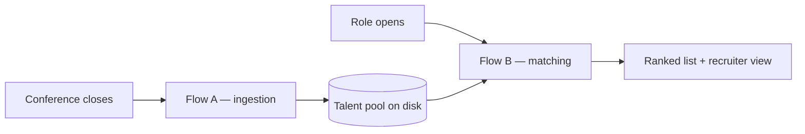
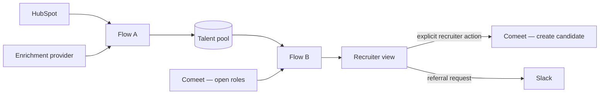

# Design document

Conference-attendee talent pool: capture attendees as leads, enrich them once, and rank the pool
against an open role on demand.

Deeper material — full architecture, exact scoring rules, column contracts, failure modes — is in
[`docs/reference/`](docs/reference/). For the version with no jargon in it, skip to
[**For a non-technical reader**](#for-a-non-technical-reader).

---

## 1. Why this approach

### Two flows on two triggers, not one pipeline

> **Partition rule.** Anything true about a person *regardless of any job* → **Flow A**, run once
> after each conference. Anything measured *against a specific job* → **Flow B**, run on demand.

So skill *normalization* is Flow A and skill *overlap* is Flow B; referral *edge construction* is
Flow A and referral *selection* is Flow B.

Three consequences make it work:

- **Expensive work runs once per person, not once per person per job.** Profile enrichment is rate
  limited and costs per lookup; running it per query would not survive a real provider.
- **Flow B makes no external call.** It is arithmetic over pre-processed data, so it stays fast as
  the pool grows.
- **The flows share no process state.** The pool on disk is the only interface, so ingestion can run
  today and matching next month — which is the actual usage pattern.

### Separating "who was in the room" from "who fits this role"

Signal-to-noise is two questions, not one, and they need different answers.

*Does this person fit this role?* is answered by ranking, below — nothing is filtered, and the
hospital IT manager lands 55th of 75 for JOB001. But that answer only exists once a role exists, and
it is about **us**. The other question — *who from this event genuinely works in what this event was
about?* — has no job in it at all. It is a property of the person and the conference, so it belongs
to Flow A and is computed once, at ingestion, into three columns: a score, a class and a reason.

The distinction that makes it work is what each kind of event is legible from:

| The event is about | Read from | Because |
| :---- | :---- | :---- |
| **a discipline** — DevOps, data engineering, broadcast | title + skills | a title tells you whether somebody practises a craft. The employer's sector does not: a DevOps engineer at an agriculture company is a DevOps person |
| **a subject** — sports technology | skills + industry | every discipline attends a sports-tech summit, so the title tells you almost nothing. What they work on and where they work does |

Two weight sets, one per kind, declared per event in `conference_domains.json`. Nothing per-domain
to tune.

**What it finds in the supplied data**, with no job involved:

| Event | Core | Adjacent | Off-domain |
| :---- | ---: | ---: | ---: |
| SportsTech Innovation Summit (40) | 12 | 10 | 18 |
| Broadcast & Streaming Technology Expo (12) | 9 | 1 | 2 |
| Data & AI Summit Europe (12) | 11 | 1 | 0 |
| DevOps World 2025 (11) | 10 | 0 | 1 |

The one person DevOps World rejects is a network engineer at a telecoms company — the brief's own
example of the noise a DevOps event attracts. The two the broadcast expo rejects are an IT engineer
at a textile manufacturer and a healthcare software engineer. And the sports summit's 18 are the
banking, insurance, legal, logistics, government, pharma, agriculture and pet-industry attendees:
real people at a real event, none of them there for the subject.

**Three things this deliberately is not.**

It is **not a filter**. Every one of those 18 is still scored, still ranked and still in the pool.
The column describes the pool; it never narrows it.

It is **not part of `match_score`**. A8 carries no weight in Flow B and writes no column into the
match output. Relevance to an event and fit for a role are different questions, and the data
separates them in both directions. Katarzyna Wojcik, an analytics engineer at a Polish insurer, is
`core` to the Data & AI summit — she belonged in that room — and ranks 60th of 75 for the ML role,
68th for the backend one, 29th for the data role. Chiara Russo runs the other way: 3rd for JOB001 at
a score of 83, and only `adjacent` at the broadcast expo she attended, because an ML engineer doing
video captioning is one step off a room full of broadcast engineers. Both readings are correct about
different things, and collapsing them into one number would lose both.

And it is **not a verdict on a thin record**. An unverified attendee has no skills and no industry,
so the registration title is all there is. A title that lands in the event's discipline is enough to
call them core; a title that misses is not enough to call them noise, because the profile that would
show their skills is exactly what is absent. A zero on a partial read is `unassessed`
([`SPEC.md` §A8](docs/reference/SPEC.md#a8--conference-domain-relevance)).

### Transparent scoring, not a black box

Seven components, each returning a value in `[0,1]`, each multiplied by a weight. Nothing is filtered
out before being scored.

| Component | Weight | Value |
| :---- | ----: | :---- |
| Skill overlap | 30 | matched required skills ÷ total required |
| Title match | 25 | discipline head-noun of the role, plus a seniority bonus |
| Years of experience | 15 | 1.0 at or above the seniority threshold; scaled below |
| Industry | 13 | 1.0 sports; 0.5 adjacent video/broadcast/streaming; 0 otherwise |
| Field notes | 10 | 1.0 if the note references a key domain; 0.5 generic; 0 absent |
| Past companies | 5 | 1.0 sports; 0.5 media or video; 0 otherwise |
| Conference domain | 2 | 1.0 if the event domain overlaps the role's domains; 0 otherwise |

**Three of these weights are set by a named counter-example in the supplied data.** Chiara Russo
attended a broadcast expo rather than a sports or ML event, yet she is a senior ML engineer building
automated sports clipping in PyTorch — a conference tells you where somebody was on a Tuesday, not
what they do, so it is worth 2. Yuki Tanaka carries the maximum sports signal in the dataset — NBA,
previously Sportradar and Nielsen Sports — but works in Spark, dbt and Airflow, with no PyTorch and
no computer vision; he lands mid-pack for JOB001 and near the top for JOB004, which is the intended
behaviour and why industry is capped at 13. And 41 of the 75 attendees carry a field note, clustering
on strong candidates — a human at the event was discriminating well. But an absent note means nobody
got to that person, not that the person is irrelevant, so weighting notes heavily would score *how
busy the booth was* rather than candidate quality. Ten points separates equals without punishing the
unspoken-to, and `flagged_on_site` carries the human signal independently of the number. If on-site
staff recorded a structured judgment instead of free prose, that weight could justifiably rise.

**Separating the value from the weight is the whole design.** The component states a fact — four of
five required skills is `0.80`. The weight states a judgment — what that fact is worth for this role.
Keeping them apart is what lets the recruiter view expose the weights as **live sliders**, makes each
score readable as `value × weight = points`, and makes normalization for missing data possible.

The weights are a reasoned starting point, not a derivation — deriving them needs hiring-outcome
history. They encode a stated ordering: skills and title dominate because they describe what a person
*does*; the conference barely matters. Once outcomes accumulate they can be calibrated from results.

**Why nothing is filtered.** A sports-tech conference draws practitioners *and* an IT manager from a
hospital. The tempting fix is to filter on title, and it is wrong: filtering on title would have
removed Priya Anand — whose title contains no "ML" — before her skills were read, and she is one of
the strongest candidates for JOB001. Her listed skills name neither required skill outright: under
exact matching she clears 2 of 5. But YOLO *is* an object-detection model and OpenCV *is* a
computer-vision library, so alias-resolved matching puts her at 4 of 5 — roughly 12 points, and the
distance between mid-pack and top-tier. Against a role, noise is separated by *ranking*, not by
exclusion: the hospital IT manager scores 0 on skills, title, industry and notes, and lands 55th of
75. She is also `off_domain` for the event she attended — but that is the other question, answered
above, and neither answer removes her row.

### Where a model earns its cost

> **A model reads free text. Rules compare structured fields.**

The supplied data is overwhelmingly structured — skills are delimited lists, experience is an
integer. Comparing structured fields is arithmetic: exact, free, instant, explainable. Wrapping it in
a model adds latency, cost and non-determinism while producing a similarity number a recruiter cannot
defend to a hiring manager. That rules out RAG and vector search too: there is no unstructured corpus
here, and approximate retrieval would replace an exact comparison with a score that has no reason
attached.

**The same reasoning rejects an autonomous agent.** The framing is fair as a *description* of this
system — Flow A as an ingestion agent, Flow B as a matching agent — and each stage is already
isolated enough to be lifted into a service. But handing the **scoring** to an agent would be a
regression: the same candidate may score 79 or 81 across runs, at added latency and per-candidate
cost, in exchange for an explanation the deterministic version already produces exactly. The brief
requires a recruiter to be able to say "she matches 4 of 5 required skills, missing PyTorch" — not
"the system said 80%".

Free text exists in exactly four places, and each is a documented seam:

| Touchpoint | This submission | In production |
| :---- | :---- | :---- |
| Non-standard skill names | dictionary lookup | model resolves misses, caches back to the dictionary |
| On-site field notes | token extraction against a vocabulary | model returns structured signal tags |
| Job descriptions | parsed from three CSV columns | model parses a prose role description |
| Rationale and probes | template over component values | model infers what to ask on the call |

Worth stating rather than hiding: three of the four are neutralized here *because the task supplied
data that was already structured*. In a real deployment they carry real work.

**No model runs on the default path**, so this repo needs no API key and the same candidate scores
the same number on every run. A shortlist that shifts between executions cannot be defended.

**One measured effect, verifiable without a key.** The alias dictionary was generated by a model
(`pipeline/build_aliases.py`, run once, result committed). Before it resolved "Sports CV" and "Event
Detection" against Marcus Reid's skills he ranked 5th at 75, missing 3 of 5 required skills. After,
he ranks 2nd at 87, missing only AWS. **No scoring code changed** — the swing is entirely the
generated dictionary.

### Referrals are context, not points

Mutual connections carry **zero scoring weight**. They say nothing about professional fit; a strong
candidate is strong with zero connections. What the team needs is *who to ask*, so the output names
the person. Both sides of the data carry dates — the roster's `work_history` and the candidate's
`past_titles` — so a shared employer becomes checkable: two people who **actually overlapped**, not
merely both drew a paycheck there.

**The distribution is the empirical half of the argument.** Of the 75 attendees, **33 have no mutual
connection, 37 have one or two, and only 5 reach three** — a signal with half the population in a
single bucket cannot carry scoring weight. Shared employers are rarer and sharper: token-bounded
matching against dated `past_titles` finds **20 candidate-employee pairs across 12 candidates**, and
**16 of the 20** have tenures that genuinely overlap. One of the remaining four is a dirty-data case
— a malformed date range that still matches on company name but yields no parseable dates, so it is
treated as "no overlap" rather than guessed at. **32 of the 75 have no edge at all**; they are still
scored and ranked, and the view shows *No referral path*. Missing a referral is not a mark against a
candidate.

| Tier | Condition | Pairs |
| :--- | :---- | ---: |
| **A** | shared employer + confirmed overlap + a mutual connection | 12 |
| **B** | no shared employer, 3+ mutual connections | 11 |
| **C** | 1–2 mutual connections, or a shared employer backed by only one of {overlap, mutual} | 60 |
| **D** | shared employer, no overlap, no mutual connection | 2 |

The recruiter-facing string never overstates. Every string the view can render, and the row that
produces it:

| Condition | String shown | Fires on |
| :---- | :---- | :---- |
| Shared employer, tenures overlap | `worked together at Opta Sports, 2019-2021` | HS013 Marcus Reid |
| Shared employer, no overlap | `both worked at IDF Intelligence Unit, no overlapping years` | HS026 Grace Wilson |
| 3+ mutual connections | `3 mutual connections` | HS025 Lucas Evans |
| 1–2 mutual connections | `2 mutual connections` / `1 mutual connection` | HS068 Chiara Russo / HS044 Sara Lindqvist |
| No edge at all | `No referral path` | HS041 Viktor Novak |
| Best edge retired | falls through to the next-best edge | `data/edge_cases` EC008 |

The last row is not producible from the supplied CSVs — no `insufficient` value exists in them to
select against — which is one of the reasons the fixture exists.

**A tier is an estimate from data; the truth comes from asking.** Each edge therefore carries a
feedback state, and the adjustment sits **on top of** the match score rather than inside it —
`match_score` and `match_score_after_feedback` are separate columns.

| State | Meaning | Built |
| :---- | :---- | :--- |
| `not_requested` | Nobody has been asked yet — the default on every edge | ✅ |
| `insufficient` | The colleague replied "I don't really know them". The path is **retired** and never surfaced for that candidate again | ✅ |
| `pending` | Asked, awaiting a reply | design |
| `positive` | Happy to refer; feeds `match_score_after_feedback` | design |
| `reserved` | Already referring this person to another role | design |

Two of the five are wired: ingestion writes `not_requested`, and referral selection retires an
`insufficient` edge before choosing. The other three need the request workflow that does not exist
yet — the field is the schema for it, not a claim that it runs.

---

## 2. Assumptions

| # | Question | Answer |
| :--- | :---- | :---- |
| 1 | **Defining domain relevance** | Two answers, because it is two questions. *Fit for a role*: a weighted, transparent score — never a filter; nobody is excluded before being scored and noise sinks in the ranking. *In-domain for the event they attended*: `conference_relevance` / `conference_class` / `conference_relevance_why`, computed at ingestion with no job involved, from title and skills for a discipline event and from skills and industry for a subject one. Neither one filters, and the second carries no weight in the first. |
| 2 | **No LinkedIn profile match** | **Kept and flagged**, never dropped. Only three of seven components are computable (title, notes, conference), so the score is normalized over those weights — `25+10+2 = 37` — and the record carries `unverified`. Missing data must not read as poor fit. |
| 3 | **1 mutual connection vs. 3** | Neither scores points. Both become *who to ask*, graded A–D by combining connections with confirmed tenure overlap. |
| 4 | **Candidates already in the ATS** | Flagged via `ats_status`, populated in production by a **read-only** lookup returning whether a process exists, its outcome and date. Here the column exists and is empty. |
| 5 | **Refresh cadence** | Ingest after each conference (2–3×/month); match on demand; re-enrich profiles every 6–12 months; archive after 36 months without interaction. |
| 6 | **Who triggers it** | Ingestion automatic on event close. Matching recruiter-initiated. **ATS handoff manual by design** — consent is the trigger and is not machine-detectable. |
| 7 | **Privacy / GDPR** | A registrant consented to attend an event, not to join a candidate database. The pool therefore **lives outside the ATS**; the registration form carries a **soft opt-in**; every record stores its source event and capture date and honours deletion. LinkedIn's terms prohibit scraping, so production enrichment goes through a licensed provider. |

**On data quality.** All 75 supplied attendees match a LinkedIn profile, so the `unverified` branch
is implemented but not exercised by the provided files — `data/edge_cases/` is a synthetic fixture
built to exercise it and eleven other branches the supplied data never reaches. Company matching is
token-bounded rather than substring-based, because naive matching pairs a candidate from `Intel` with
an employee from an `IDF Intelligence Unit`. A malformed tenure date is treated as "no overlap"
rather than guessed at.

**There is deliberately no name-based fallback.** Joining on name where `linkedin_url` fails would
raise coverage and lower trust. Common names produce false matches, and attaching the wrong LinkedIn
profile to a candidate is worse than attaching none — it puts fabricated skills and experience into a
shortlist a recruiter will act on. The registration email remains a valid outreach path regardless.

**Correct arithmetic is not the same as an honest screen.** An unverified row normalized over 37 can
reach 100, and in the fixture it does, ranking #1 of 13. The number is right; the *display* was not. A
bare `100` beside a name, with four uncomputed components rendered as red "missing" chips, told a
recruiter the opposite of the truth — that the person had been assessed and found wanting. The
`Unverified` badge, the `out of 37, not 100` label and the suppressed gap chips
([`SPEC.md`](docs/reference/SPEC.md) §7) exist to close that gap.

**On scope.** `ats_status` and `referral_feedback` are emitted and unpopulated — the fields are
defined, the data is not available here.

---

## 3. Production integrations

| Direction | System | Requirement |
| :---- | :---- | :---- |
| Read | **HubSpot** | event registrants as contact records, with custom properties for talent-pool fields |
| Read | **Comeet** | open roles by id; candidate history by identifier |
| Write | **Comeet** | create a candidate **on explicit recruiter action**, with source attribution |
| Read | **Enrichment provider** | profile data keyed on profile URL, batched and queued |
| Write | **Slack** | referral request to the connected employee, with structured reply options |

**The supplied CSVs represent a capture layer that runs before ingestion:** registration writes a
lead to HubSpot → badge scan reconciles attendance → staff add a structured annotation → a licensed
provider enriches on profile URL → canonical skill resolution → contact-property write.

**On the LinkedIn API.** There is no public LinkedIn API for this, and their terms prohibit scraping.
Production enrichment goes through a **licensed data provider** keyed on the profile URL. Three
constraints the design already absorbs: it is rate limited, so enrichment is batched and queued
rather than synchronous; coverage is partial, so unmatched contacts are flagged `unverified` rather
than dropped; and it costs per lookup, so enrichment runs **once per person in Flow A** and never per
query in Flow B.

**Connection data is not part of it.** A provider sells public profile data; nobody legally sells a
private connection graph. Mutual connections require **per-employee consent** either way — a
Recruiter seat with TeamLink, or a voluntary connection export — so the design treats them as a
consent-gated bonus, **not a dependency**: Flow A's shared-employer step (A6 — comparing the HR
roster's `work_history` against the candidate's `past_titles` to find a common employer and a
confirmed overlap in years) builds edges with no connection data at all. It reaches 12 of the 75
supplied attendees, one of whom has no mutual connection anywhere and would otherwise have no path
at all. The cost is worth stating plainly rather than softening: strip connection data and tiers A
and B go silent, leaving only those 12 with any referral edge. That is a degradation of the referral
layer, not a failure of the system — the ranking itself never depended on it. This is the second
consent in the design — assumption 7 covers the registrant's; this one is the employee's.

**On HubSpot.** Talent-pool fields map onto contact properties, so the pool *extends* contact records
rather than creating a parallel database. HubSpot stays the system of record for the contact;
scoring lives in the pipeline.

**On Comeet.** The stated constraint is that leads may not be held in the ATS. The distinction that
resolves it: *storing a pool* is not *entering a person*. The pool lives outside; an individual
enters only when a real process begins, and only on a recruiter's explicit click. A Comeet webhook on
role-open can pre-warm a shortlist, but nothing advances a person automatically.

**What does not change.** The entire scoring path is byte-for-byte identical between this submission
and production. It has no integration dependency, which is what makes the ranking defensible.

---

## 4. At scale

Hundreds of conferences and thousands of contacts is the stated target. Concretely: ~30 events per
year at 30–100 attendees is 900–3,000 new records annually — **5,000–9,000 rows after three years**,
against five recruiters and tens of concurrent roles. Well past where spreadsheets collapse; far
short of anything needing distributed infrastructure.

| Concern | At this scale |
| :---- | :---- |
| **Flow A** | Decomposes into one scheduled worker per stage with retries and queues — no restructuring needed, because the stages already share no state. |
| **Flow B** | Stays a single-pass scan over a table. Sub-second at 10k rows. |
| **Storage** | HubSpot contact properties, not a new database. The pool is a segment, not a system. |
| **Model cost** | Negligible. After exact and dictionary matching, a 100-person event generates on the order of tens of alias-resolution calls, twice a month, **decaying as the dictionary saturates**. |
| **Enrichment cost** | The dominant real cost, and the reason it is once-per-person. Bounded by new attendees, not by queries. |
| **Referral load** | One employee already connects to 14 of the 75 attendees. A per-employee request cap becomes necessary well before the data does. |

The architecture that makes this hold is the two-flow split. Because matching never enriches, adding
roles costs nothing; because ingestion never scores, adding conferences costs nothing beyond the
enrichment itself.

---

## 5. What I would add with more time

| | Why |
| :---- | :---- |
| **A vocabulary that maintains itself** | `conference_domains.json` is hand-written per event domain. Generating it from the event's own published programme — and reviewing it — would make A8 hold for a conference nobody anticipated, instead of one already on file. |
| **One-click referral request with structured replies** | Closes the loop that `referral_feedback` already models but nothing yet writes. |
| **Structured on-site annotation** | Replacing free-text notes would raise the ceiling on that signal from 10 points to something much higher. |
| **Pipeline status tracking** | First contact through process, so the pool shows state rather than a snapshot. |
| **Conference ROI analysis** | The measurement that source tagging makes possible — which events actually produce placements. |
| **Outcome-driven weight calibration** | Replace the reasoned starting point with weights derived from hires. |
| **Employee past-company data** | Would close the remaining referral gap; only the candidate side is fully dated today. |

### Open questions

Stated rather than invented, because the answers depend on how the team works: conflicting referrals
when two colleagues disagree; whether an `insufficient` response expires; the per-employee referral
cap; whether the ATS constraint is regulatory, contractual or operational (the design assumes the
most restrictive reading); and where the match percentage should change colour.

---

## For a non-technical reader

Every month the team fills a room with exactly the engineers it wants to hire, and within days those
contacts are gone. This system turns each event into a permanent, searchable talent pool: every
attendee is enriched once and stored, and when a role opens the pool is ranked against it in seconds.
A recruiter sees a short list — the person, a match percentage, the skills they have and the ones
they're missing, and where one exists, the name of the colleague who already knows them. Every score
opens up to show how it was calculated, so the shortlist can be defended to a hiring manager rather
than trusted blindly.
