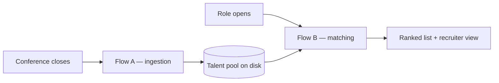
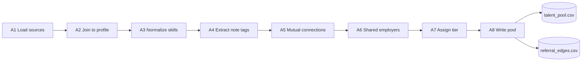
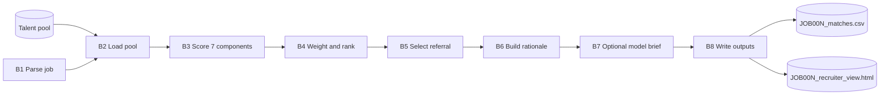
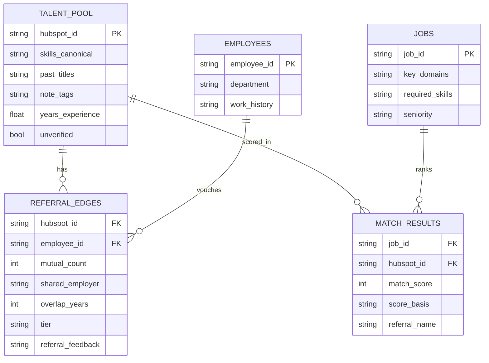

# SPEC — architecture and implementation contract

What the system is, how it is partitioned, and exactly what each step must produce. `DESIGN.md`
explains **why** and wins wherever the two disagree. `README.md` covers setup and how to run.

---

## 0. System shape

Two flows on two triggers, sharing no process state. The pool on disk is the only interface
between them.



The partition rule and its rationale are in
[`DESIGN.md` §1](../../DESIGN.md#two-flows-on-two-triggers-not-one-pipeline). What this document
adds is the contract each flow must satisfy.

**Invariants.**

- Flow A never reads a job row. Flow B never reads `conference_attendees.csv` or `linkedin_profiles.csv`.
- Flow A is idempotent on `hubspot_id`.
- Flow B is a pure function of the pool, the job row and the config files — no network, no clock, no randomness.
- Two consecutive runs of either flow produce byte-identical output.

Python 3.10+, pandas only. **On the default path there are no network calls, no API keys and no
model calls at runtime.** One opt-in exception, `match --llm`, is specified in §8.

---

## 1. Repository layout

```
data/
  conference_attendees.csv    linkedin_profiles.csv    wsc_employees.csv    job_openings.csv
  skill_aliases.json          title_families.json      company_domains.json
  edge_cases/                 the same seven files, synthetic, plus:
    referral_feedback.csv     optional 8th source — seeds retired edges (§4)
pool/
  talent_pool.csv             referral_edges.csv                    written by Flow A
  edge_cases/                 fixture pool
output/
  JOB00N_matches.csv          JOB00N_recruiter_view.html            written by Flow B
  edge_cases/                 fixture output
pipeline/
  ingest.py  enrich.py  score.py  output.py  main.py
  llm.py                      B7 live seam — imported only under `match --llm`
  build_aliases.py            offline generator for skill_aliases.json
tests/
  test_pipeline.py            the §11 acceptance checks — python3 -m unittest discover tests
recruiter_view.html           per-role template, copied by B8
index_template.html           landing-page template
index.html                    generated landing page — the reviewer's entry point
docs/reference/
  SPEC.md                     this document
  alias_generation_log.md     record of the build_aliases.py run
  images/                     README screenshot, rendered from the committed recruiter view
README.md  DESIGN.md  requirements.txt
```

Config is data, not code: extending the alias table requires no release.

---

## 2. Command line

```
python pipeline/main.py ingest                 # Flow A. reads data/, writes pool/
python pipeline/main.py match --job JOB001     # Flow B. reads pool/ + job_openings.csv, writes output/
python pipeline/main.py run   --job JOB001     # both, in order
python pipeline/main.py index                  # rebuild index.html (auto-run after match/run)

python pipeline/main.py match --job JOB001 --llm            # + B7 live seam (needs ANTHROPIC_API_KEY)
python pipeline/main.py ingest --data-dir data/edge_cases   # any dir holding the same source files
```

`--data-dir` namespaces the pool and output directories by that directory's name
(`pool/<name>/`, `output/<name>/`), so a fixture run can never overwrite the real one.

| Failure | Behaviour |
| :---- | :---- |
| `pool/` empty or missing | non-zero exit naming the `ingest` command |
| unknown `--job` | non-zero exit listing the valid ids |
| unknown `seniority` in a job row | raises, naming the job id |

---

## 3. Stores

| Path | Kind | Written by | Read by |
| :---- | :---- | :---- | :---- |
| `data/conference_attendees.csv` | source | — | A1 |
| `data/linkedin_profiles.csv` | source | — | A1 |
| `data/wsc_employees.csv` | source | — | A1 |
| `data/job_openings.csv` | source | — | B1 |
| `data/skill_aliases.json` | config | `build_aliases.py`, offline | A3, B1 |
| `data/title_families.json` | config | — | B3 |
| `data/company_domains.json` | config | — | B3 |
| `<data-dir>/referral_feedback.csv` | source, **optional** | recruiter (production: HubSpot). Absent under `data/`; present under `data/edge_cases/` | A7 |
| `pool/talent_pool.csv` | state | A8 | B2 |
| `pool/referral_edges.csv` | state | A8 | B2 |
| `output/JOB00N_matches.csv` | artifact | B8 | index |
| `output/JOB00N_recruiter_view.html` | artifact | B8 | — |
| `index.html` | artifact | `main.py index` | — |

---

## 4. Flow A — ingestion

Runs once per person, per conference. No job is involved and none may be referenced.



| Step | Module · function | Input | Output |
| :---- | :---- | :---- | :---- |
| A1 | `ingest.load_sources` | four CSVs, three JSON, optional feedback CSV | dataframes + config dicts |
| A2 | `enrich.join_profiles` | attendees, profiles | one row per attendee, `unverified` flag |
| A3 | `enrich.normalize_skills` | `top_skills`, aliases | `skills_canonical`, `skills_alias_hits` |
| A4 | `enrich.extract_note_tags` | `notes` | `note_tags`, `flagged_on_site` |
| A5 | `enrich.resolve_mutual_connections` | `wsc_mutual_connections`, roster | one edge per listed employee, `mutual_count` |
| A6 | `enrich.find_shared_employers` | `past_companies`, `past_titles`, `work_history` | more edges, `shared_employer`, `overlap_*` |
| A7 | `enrich.assign_tier` | edge attributes | `tier` ∈ {A, B, C, D}, `referral_feedback` |
| A8 | `enrich.write_pool` | rows, edges | two CSVs |

### A2 — join

Key is `linkedin_url`, exact match after stripping whitespace, a leading `https://` and `www.`. **No
name-based fallback** — common names produce false matches, and misidentifying a candidate is worse
than not identifying one (`DESIGN.md` §2).

An unmatched row is **kept** with `unverified = True` and profile-derived fields empty. In the
supplied data all 75 rows match, so this branch is code and documentation, not a demonstrated path;
`data/edge_cases/` exercises it.

### A3 — skill normalization

`skill_aliases.json` maps lowercased alias → canonical name. Resolution order: exact
case-insensitive match on the canonical set, then the alias table, then `resolve_unknown_alias`,
which returns the token unchanged and carries the §8 seam docstring.

Keep both forms: `skills_raw` and `skills_canonical`, plus `skills_alias_hits` — the `raw ->
canonical` pairs the alias table resolved. The third is what the recruiter view shows as a blue chip.

### A4 — field notes

Lowercase the note, strip punctuation and stopwords, return the remaining tokens plus their
canonical forms. `flagged_on_site = bool(note.strip())`. Note **value** depends on the job and
belongs to B3.

### A5 — mutual connections

`wsc_mutual_connections` is a `;`-separated list of employee ids, possibly empty. Emit one edge per
id carrying that employee's name, title and department. `mutual_count` is the length of the list,
written identically onto every edge of that candidate.

### A6 — shared employers and tenure overlap

Compare `past_companies` against each employee's `work_history` (`Company (YYYY-YYYY);…`). Strip the
date parenthesis, lowercase, tokenize.

Stem every token longer than four characters by removing a single trailing `s`, and stem the
drop-list identically — otherwise `sports` on the drop-list and `sport` on a company name stop being
the same token. Drop these generic tokens post-stemming:

> `technologies, software, group, sports, lab, labs, research, unit, freelance, startup, inc, ltd,
> media, digital, online, global, network, solution, service, system, international, company,
> holding, studio, partner, venture, consulting, agency, technology`

A match requires a **shared non-generic token of four characters or more**. Substring matching is
forbidden: it pairs a candidate from `Intel` with an employee from `IDF Intelligence Unit`.

On a match, derive the overlap window. The candidate's tenure comes from `past_titles`
(`Title at Company (YYYY-YYYY)` — the one candidate field carrying dates, open-ended as `-present`);
the employee's from `work_history`. `overlap_years` is the intersection in whole years and
`overlap_period` its `YYYY-YYYY` string; both are `0` / empty when the ranges are disjoint or either
side is missing or unparseable.

This step may create an edge for a candidate with zero mutual connections. That is the point of it.

### A7 — tier

Three signals: a shared employer, whether the two tenures **actually overlap**, and whether *this*
employee is one of the candidate's listed mutual connections (`mutual_count ≥ 1` on this edge).

| Tier | Condition | Reading |
| :---- | :---- | :---- |
| **A** | shared employer **and** overlap **and** a mutual connection | ask first — they were there together, and know someone in common |
| **B** | no shared employer, `mutual_count ≥ 3` | familiarity is plausible |
| **C** | `mutual_count` ∈ {1, 2}; **or** shared employer, no overlap, with a mutual connection; **or** shared employer with overlap, no mutual connection | worth a careful ask |
| **D** | shared employer, no overlap, no mutual connection | weakest signal that still earns a row |

Overlap is only ever nonzero when `shared_employer` is set, so "overlap without a shared employer" is
not a case. Every edge carries exactly one tier; an edge matching none raises rather than returning
an empty tier. Only a candidate with **no edge at all** has no row.

`referral_feedback` is not derived from any source record — in production a recruiter writes it back
through HubSpot after asking the colleague. A7 reads it from `referral_feedback.csv`
(`hubspot_id, employee_id, referral_feedback`) when that file is present, and writes `not_requested`
for every edge when it is absent, as it is under `data/`.

### A8 — output columns

**`pool/talent_pool.csv`** — one row per attendee, keyed on `hubspot_id`:

`hubspot_id, full_name, email, company, title, linkedin_url, current_company, current_title,
location, years_experience, industry, past_companies, past_titles, skills_raw, skills_canonical,
skills_alias_hits, note_raw, note_tags, flagged_on_site, unverified, conference_name,
conference_domain, conference_date, source, first_seen_at, last_refreshed_at, ats_status,
pool_status`

**`pool/referral_edges.csv`** — one row per candidate-employee pair, keyed on `hubspot_id` +
`employee_id`:

`hubspot_id, employee_id, employee_name, employee_title, employee_department, mutual_count,
shared_employer, overlap_years, overlap_period, tier, referral_feedback`

List-valued columns are `;`-separated. `ats_status` is written empty — the field exists, the data
does not. `referral_feedback` is an attribute of the **pair**, so it lives only on the edge file.

---

## 5. Flow B — matching

Runs per open role. Arithmetic only: nothing in `data/` is re-derived and no external call is made.



| Step | Module · function | Produces |
| :---- | :---- | :---- |
| B1 | `score.parse_job` | requirement set + domain vocabulary |
| B2 | `main.read_pool` | pool rows, edge rows |
| B3 | `score.score_components` | seven floats in `[0,1]`, `score_basis` |
| B4 | `score.rank` | `match_score`, `points_*`, rank order |
| B5 | `output.select_referral` | one edge or none |
| B6 | `output.build_rationale`, `build_interview_probes` | plain-language explanation |
| B7 | `output.apply_llm_*` | `ai_summary` / `ai_probes` — **opt-in only**, §8 |
| B8 | `output.write_matches_csv`, `write_recruiter_view` | two artifacts |

### B1 — requirement set

`required_skills` and `nice_to_have` split on `;` and normalized through the alias table;
`key_domains` split on `;` then tokenized; `seniority` mapped to a years threshold.

`domain_vocabulary` = key-domain tokens plus their alias expansions, minus stopwords. Both the title
component and the conference component read this one vocabulary.

### B3 — the seven components

Every component returns a value in `[0, 1]`. **Weight is applied once, in B4. A component never
returns points.**

| Component | Weight | Value |
| :---- | ----: | :---- |
| **Skills** | 30 | `matched ÷ len(required_skills)`, matched on `skills_canonical` |
| **Title** | 25 | `min(1.0, core + seniority_bonus)` — see below |
| **Experience** | 15 | `1.0` at or above the threshold, else `years ÷ threshold` |
| **Industry** | 13 | `1.0` if `industry` contains `sport`; `0.5` for video/broadcast/streaming/media/ott; else `0` |
| **Field notes** | 10 | `1.0` if `note_tags` ∩ `domain_vocabulary`; `0.5` if a note exists with no overlap; `0` if no note |
| **Past companies** | 5 | best over `past_companies` via `company_domains.json`: `1.0` sports, `0.5` media/video, else `0` |
| **Conference domain** | 2 | `1.0` if `conference_domain` tokens ∩ `domain_vocabulary`, else `0` |

Seniority thresholds: `Junior` 2, `Mid` 3, `Mid-Senior` 5, `Senior` 6.

**Title sub-rule.** Clean first: take the part before ` - `, lowercase, remove
`senior, sr, staff, principal, lead, head, of, junior, jr`.

| Core | Condition |
| ----: | :---- |
| `0.7` | the cleaned title **ends with** an entry from the job department's list in `title_families.json` |
| `0.25` | it does not, but the title contains a `domain_vocabulary` token |
| `0` | neither |

| Bonus | Original title contains |
| ----: | :---- |
| `+0.3` | `senior`, `sr`, `staff` |
| `+0.15` | `principal`, `lead`, `head` |

`endswith` is deliberate: it reads the head noun and ignores qualifiers, so `senior computer vision
engineer` and `sports data scientist` both land on their family.

**Skills emits three lists** for the output: `skills_matched` (exact on the raw list),
`skills_semantic` (matched only after alias resolution, as `raw -> canonical`), and `skills_missing`.

### B3 — unverified candidates

With no profile, exactly **three** components are computable: `title`, `notes`, `conference`
(industry, skills, experience and past companies all come from the profile). Sum only those weights
and divide by that sum — `25 + 10 + 2 = 37` — rather than by 100, and set `score_basis` to the list
used. **Missing data must not read as poor fit** (`DESIGN.md` §2). Presentation rules in §7.

### B4 — weights and ranking

Defaults live in one dictionary in `score.py` and are written into both the CSV and the HTML from
that same dictionary:

`skills 30, title 25, experience 15, industry 13, notes 10, past 5, conference 2` — sum 100.

`match_score = round_half_up(Σ(value × weight) ÷ Σ(weight) × 100)`, where
`round_half_up(x) = floor(x + 0.5)` rather than Python's `round()`, which rounds half to even. This
matches `Math.round` in the recruiter view, so a raw score of exactly `86.5` cannot round one way in
the CSV and the other on screen. Sort descending; ties break on `years_experience`, then
`hubspot_id`, so runs are reproducible.

`value_*` and `points_*` are written at **full float precision, never rounded for looks**. Several
components are non-terminating fractions — experience is `5/6` for a five-year candidate against a
six-year threshold — and four of the 75 JOB001 candidates total exactly `x.5` before rounding. A
value rounded to four decimals puts them a hair below that boundary, so a `value × weight` check
against the published columns would return a number one point under the `match_score` printed beside
it. Nothing renders these raw: the view formats every component with `toFixed(2)` before display.

### B5 — referral selection

Among that candidate's edges: highest tier first, then smallest department distance to the job's
department, then highest `mutual_count`. Department distance is an explicit map — same department 0,
a named adjacent pair 1, anything else 2. Any edge whose `referral_feedback` is `insufficient` is
**retired before choosing**.

`referral_why` as plain text:

| Condition | String |
| :---- | :---- |
| shared employer, `overlap_years > 0` | `worked together at Mobileye, 2019-2021` |
| shared employer, no overlap | `both worked at Mobileye, no overlapping years` |
| no shared employer | `3 mutual connections` (singular at 1) |

"Worked together" is written **only** when the dates back it up. A shared employer alone proves only
that both were there at some point.

### B8 — output columns

**`output/JOB00N_matches.csv`:**

`job_id, hubspot_id, full_name, current_title, current_company, years_experience, location,
linkedin_url, match_score, match_score_after_feedback, score_basis, value_skills, value_title,
value_experience, value_industry, value_notes, value_past, value_conference, points_skills,
points_title, points_experience, points_industry, points_notes, points_past, points_conference,
skills_matched, skills_semantic, skills_missing, rationale, interview_probes, ai_summary, ai_probes,
referral_name, referral_title, referral_department, referral_tier, referral_why, referral_feedback,
flagged_on_site, unverified, ats_status, conference_name, conference_date`

`match_score_after_feedback` equals `match_score` while no feedback exists. It is a separate column
because the adjustment sits **on top of** the fit score, never inside it. `ai_summary` / `ai_probes`
are empty on every default run, including every committed file.

Both output files are written in the same call from the same in-memory rows, so the screen cannot
contradict the table.

---

## 6. Data model



`REFERRAL_EDGES` is a separate relation because the cardinality is many-to-many and because
`mutual_count`, `shared_employer`, `overlap_*`, `tier` and `referral_feedback` are attributes of the
**pair**, not of the candidate. Storing feedback on the edge is what lets it adjust a score without
mutating it — `match_score` and `match_score_after_feedback` stay separate columns.

`ats_status` is emitted and unpopulated in this submission.

---

## 7. Presentation contract — the recruiter view

One self-contained file per role, opened by double click, data embedded as a JSON literal. Copy
`recruiter_view.html`, replace only the `DATA` array, the `DEF` weights, the `SUMMARY` line and the
header text. The markup, CSS and interaction are approved and are never redesigned by the generator.

Sliders re-rank in browser memory only, never write to disk, and a reset button restores `DEF`. At
default weights the initial render displays the CSV's `match_score` directly rather than recomputing
it, so the two cannot disagree at the one point where they'd be compared.

**Unverified rows are labelled, not silently scored.** Such a row carries `u` and its `score_basis`
in `DATA`; a verified row carries neither and its payload is unchanged. The view must:

- normalize the live slider recompute over the basis components **only**, matching `score_components`;
- list only those components in the breakdown, mark the rest `not scored`, and label the total `out of 37, not 100`;
- **suppress the red `<skill> missing` chips** — with no profile a required skill is unassessed, not absent;
- omit an absent `years_experience` or `location` rather than rendering the gap;
- carry a badge stating that no LinkedIn profile matched and what the score is based on.

`build_rationale` and `build_interview_probes` take the same branch: no `N/M required skills matched`
sentence and no `Probe depth on:` list, because both report a comparison that never happened.

**`index.html`** is the landing page: every role with its headline numbers, opening that role's view
on click, plus a jump-by-id box. Generated from `index_template.html` by `output.write_index`, which
is the one writer that *reads* from `output/` — the landing page spans every role while `match` runs
one at a time. It refreshes after every `match` / `run`, including a `--data-dir` run: `write_index`
always reads the real `data/` and `pool/`, so a fixture can only change the fixture link. Refreshing
unconditionally is what makes `index.html` independent of the order the commands were run in.

---

## 8. Modules and the model boundary

| Module | Flow | Steps | Owns |
| :---- | :---- | :---- | :---- |
| `ingest.py` | A | 1 | file reads only |
| `enrich.py` | A | 2–8 | join, normalization, tags, edges, tiers, pool write |
| `score.py` | B | 1, 3, 4 | requirement parsing, components, normalization, ranking |
| `output.py` | B | 5–8 | referral selection, rationale, CSV writer, HTML writers |
| `main.py` | both | B2 | argument parsing, sequencing, and the pool read — no scoring logic |
| `llm.py` | B | 7 | the B7 seam's live implementation — opt-in |
| `build_aliases.py` | — | — | offline alias generator, not imported by `main.py` |

**Default path dependency direction is one-way:** `main` → `{ingest, enrich, score, output}`.
`ingest`, `enrich` and `score` import no peer and no network library at all; `output` imports no peer
at module level. A default `ingest` / `match` / `run` loads nothing that can open a socket.

### The four free-text touchpoints

Why these four and nothing else: [`DESIGN.md` §1](../../DESIGN.md#where-a-model-earns-its-cost).

| Touchpoint | Step | Submitted | Seam |
| :---- | :---- | :---- | :---- |
| Unknown skill alias | A3 | dictionary lookup, passthrough on miss | `resolve_unknown_alias` |
| Field note | A4 | token extraction against a vocabulary | `extract_note_tags` |
| Job description | B1 | parsed from CSV columns | `parse_job` |
| Rationale / probes | B7 | template over component values | `build_rationale`, `build_interview_probes` |

A3, A4 and B1 are deterministic in **every** run and each carries a docstring naming its production
replacement. **B7 is the one seam wired live**, behind `match --llm`.

### The two opt-in model paths

Both imports are function-local, so the default path never executes them:

| Import | Site | Reached when |
| :---- | :---- | :---- |
| `output.py` → `llm` | inside `apply_llm_briefs`, `apply_llm_job_summary` | `match --llm` |
| `llm.py` → `anthropic` | inside `build_client` | `match --llm` |
| `build_aliases.py` → `anthropic` | inside `call_model` | running that script by hand |

With `--llm` set, a job costs at most **21 calls**: one per candidate for the top 20 ranked rows
(`shortlist_size = 20`) writing `ai_summary` / `ai_probes`, and one writing the shortlist summary
line. Both are **additive** — `build_match_row` has already written the deterministic `rationale` /
`interview_probes`, and the model path never overwrites them. Both `call_*` functions return `None`
on a malformed response or an API error, and the caller treats `None` as an ordinary outcome: the
field stays empty and the run finishes. The summary line is the one field with no deterministic
counterpart, so a keyless run renders no line rather than a templated one.

**Scoring is never a model call, with or without the flag.** Nothing in `score.py` can reach
`llm.py` by any path.

---

## 9. Integration surface

The topology, the capture layer and the scale envelope are in
[`DESIGN.md` §3–§4](../../DESIGN.md#3-production-integrations). What belongs here is the per-step
mapping: what each pipeline step reads today, and what replaces it in production.

| Step | Submitted | Production |
| :---- | :---- | :---- |
| A1 | read CSVs | HubSpot contacts API by event; enrichment provider batch job |
| A2 | exact join on `linkedin_url` | provider records on the same key; unmatched go to a review queue, still `unverified` |
| A3 | dictionary lookup | dictionary + model resolution for misses, cached back |
| A4 | token extraction | model returning structured tags, or structured capture upstream |
| A5 | parse delimited id list | consent-gated — TeamLink (a Recruiter seat per employee) or a voluntary employee export; no provider sells a private connection graph. Absent when neither exists, and the shared-employer step (A6) still produces edges. Roster from the HR system |
| A6 | roster comparison | unchanged |
| A7 | tier from stored signals | unchanged; `referral_feedback` written back from HubSpot |
| A8 | write two CSVs | write HubSpot contact properties — HubSpot is the system of record |
| B1 | read three CSV columns | Comeet role by id, parsed from prose by a model |
| B2 | read two CSVs | query contact properties for the pool segment |
| **B3–B6** | **arithmetic** | **unchanged** |
| B7 | opt-in model call | same call, always on |
| B8 | write CSV + HTML | same, plus in-app view, Comeet creation on explicit action, Slack referral request |

**Two boundaries this table has to hold.** B3 through B6 are byte-for-byte identical between
submission and production — the scoring path has no integration dependency, which is what makes the
ranking testable without one. And of the two external writes, the pool write is idempotent on
`hubspot_id` while the ATS write is gated on an explicit recruiter action: **nothing advances a
person into a hiring process automatically.**

---

## 10. Failure modes

| Condition | Behaviour | Step | In supplied data |
| :---- | :---- | :---- | :---- |
| no profile match | row kept, `unverified` set, score normalized over 37 | A2, B3 | no — fixture |
| `wsc_mutual_connections` empty | no edges from A5; A6 may still produce one | A5 | yes |
| no edges at all | referral fields empty, row kept and ranked | B5 | yes |
| skill absent from the alias table | passthrough, counted as missing | A3 | no — fixture |
| note absent | notes component returns 0 | B3 | yes |
| `past_titles` date missing or unparseable | treated as no overlap, never guessed | A6 | yes (1 case) |
| open-ended `(YYYY-present)` tenure | parsed as running to the present | A6 | yes |
| edge marked `insufficient` | retired before selection, score unchanged | B5 | no — fixture |
| title in no `title_family` | title core falls to `0.25` or `0` | B3 | no — fixture |
| `pool/` empty or missing | non-zero exit naming `ingest` | B2 | CLI |
| unknown `job_id` | non-zero exit listing valid ids | B1 | CLI |

`data/edge_cases/` is a 13-row synthetic fixture built to exercise every row marked "fixture" above.
Run it with `python pipeline/main.py run --job JOB001 --data-dir data/edge_cases`; output committed
at `output/edge_cases/`.

---

## 11. Done means

- `python pipeline/main.py run --job JOB001` produces four files from a clean checkout, with no configuration and no API key.
- Two consecutive runs produce byte-identical output.
- Every number in the recruiter view traces to `value × weight` in the CSV — including unverified rows, which trace against their own basis (§7).
- A candidate with no edges renders as "No referral path" and is not dropped.
- No module reachable from a default run imports a network library.

Each of these is an assertion in `tests/`, along with the tier table, the token-bounded company
match, referral retirement, and the two CLI failure modes:

```
python3 -m unittest discover tests
```

The reproducibility tests re-run the pipeline and compare against the artifacts committed in the
repo, so a stale committed artifact fails the suite rather than passing unnoticed.
